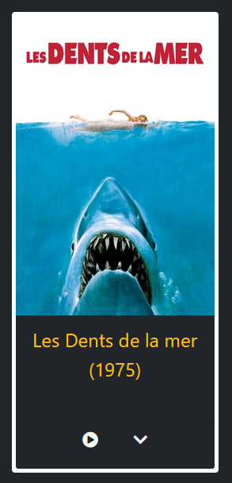

# [Getflix project challenge](https://github.com/becodeorg/BXL-Swartz-4-27/blob/master/2.The-Hill/2.PHP/GetflixProject.md)
* Repository: getflixProject
* Type of Challenge: Consolidation
* Duration: 10 days
* Deadline: 12/04/21 09:00 AM
* FORM: Coming soon
* Deployment strategy :
  * Like you want
* Team challenge : Max 4
  * frontend: 1
  * backend: 2
  * project management : 1

## [Our getflix Project (click here)](https://retro-flix.000webhostapp.com/)

## RETROFLIX

* Retroflix it's a  movies streaming website with focus on **Old Classical Films**. 
We have picked the film list from the site [Sens Critique](https://www.senscritique.com/liste/Grace_a_Youtube_vous_pouvez_decouvrir_ces_films/132727) .

### UI Overview

#### Home page:

#### Home page carousel organised by genres:

#### The Header
With links to the Home Page, Browse Movies Page, the Search bar with entries to keywords or genres, the icon to the Members area page and the icon for the members to Sign Out.

#### The Browse Movies page
The Search function works also with alphabetic order (to up & down). To each search request, the page shows the Number of total items.

#### The Film Card
Each film card it's composed by the movie original poster and a bottom section (Movie tittle & play icon - info icon) who leads both to the film streaming and to the Movie Info page.

#### The Movie Info page
This page it's at the core of the site. It shows most of the features that are present in the DB. Basic information about the movie itself and an overview (FR). At the bottom of this page, the **"Comments"** section allows the user (already Signed-in) to write down his comments but also it displays a list of older comments.

#### The Player page
The DB has a Youtube link for each movie.

## Work flow and Organisation
This project has had two mainly parts: The User's System and the DB management.

## Member system 

By following this [openclassroom course](https://openclassrooms.com/fr/courses/918836-concevez-votre-site-web-avec-php-et-mysql/917948-tp-creez-un-espace-membres) we built a basic member system. 

Here is how look the data base :

The date is generated automatically when we insert a new member in the base.

The admin field determine the user rights. If admin = 1, he's and admin and he can access to the back office to manage comment, movies, users accounts etc...

The password is hashed with the password_hash function in php.

For the avatar, a random string is added to the name to avoid duplicates.

Then the valid field indicates if the account is validated, and finally, recovery is a random string generated randomly to confirm the account creation or a password recovery.

When the user create his account a mail is sent to his mail box to confirm the registration. To do that we used [phpMailer](https://github.com/PHPMailer/PHPMailer), really easy to configure but less functionalities than MailChimp.

If the user is not connected he can't watch a movie and the play button is replaced with a "register" button. 

When he's connected he can access to his member area, change his avatar and his password.

Here is the member area:

## Mission objectives

Now is the time to take stock of everything you've learned so far and add a layer at the same time!

And what could be better for this than putting it into practice :)

## The Mission
In this exercise you must create a Streaming site in html / css, javascript and php.

Get inspired by Netflix, Amazon Prime Video and other Popcorn Time, Stremio ... The goal is to display a catalog of movies. Spot the similarities between these platforms (navbar, header, search tool, different categories of videos…) See what is cool and what works.

### Must-have features
- [x] A session system: registration, connection / disconnection.
- [x] Different rights: registrants have the right to comment on the content. You can add other rights depending on the different types of users.
- [x] Include a search bar and sort by filters
- [x] Make a secure code
- [x] Deploy the site. PHP is not supported by github, find free alternatives.

### Nice-to-have features
- [x] Management of lost passwords.
- [x] Back office for user and comment management (CRUD).
- [x] Create a page or section that displays the top movies with the movie db API.
- [ ] Integrate a newsletter with Mailchimp.

### Miscellanous information
* The videos will not be hosted by you, a simple link to the Youtube trailer will suffice.

## Deliverables
* Publish your source code on the GitHub repository.
* Pimp up the readme file:
  * What, Why, When, How, Who.
* Pending things to do
* It must contain a link to the "live" version. The "live" version must contain a link to the source code on GitHub.
* Publish the link to the "live" version on Discord.

### Steps
* Get organized. Discuss, define tasks, choose a git master, a schedule, deadlines ...
* Use Trello, google agenda ... to help you.
* Define your work methodology.
* Study the request (What & Why ?)
* Identify technical challenges (How ?)
* Make models, diagrams of the database. Do all the research beforehand. Do not start coding before your project is studied from a to z.
* Give briefings / debriefings, put a lot on communication, this is the key.
* Comment out all of your code. Without comments it will be very difficult for you to work together.
* Don't just do what you can, get out of your comfort zone.
* Each member of the team must work on the whole project.

## Evaluation criterias
| Criteria |	Indicator	| Yes/No |
|---|---|---|
| 1. | Is complete	The student has realized all must-have features.	|
| | There is a published GitHub page available.	|
| | The code is well indented and commented	|
| | The readme is clean and complete	|
| | At least one Nice-to-have features is ok	|
| 2. | Is Correct	The HTML and CSS pass the W3C Validation tool.	|
| | The lighthouse test scores 90 at least on Performance, Best Practices, Accessibility and SEO.	|
| | The code is well indented and commented....... |

 

